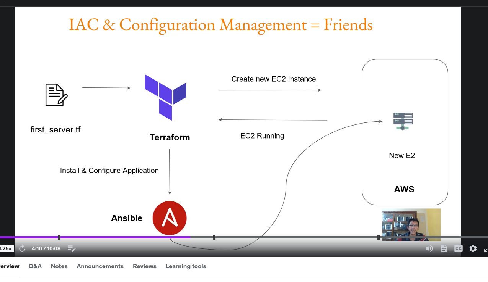

# Getting started

Course done at Hinge. Udemy course [here](https://matchgroup.udemy.com/course/terraform-beginner-to-advanced/learn/lecture/32417372#overview)

## Choosing the right Infrastructure as code tool
- chef, puppet, terraform, ansible are all infrastructure as code candidates.
- ansible, chef, puppet are mainly config management tools which means that they are primarily designed to install and manage software on existing servers
- terraform, cloudformation (aws) are infra orchestration tools which means they can provision the servers themselves, not setup the software on the servers.
- config management CAN do some infra provisioning but terraform is better.
- terraform can create ec2 instances in AWS. a response is sent back to terraform when it succeeds (see image below).

- terraform can then call ansible to install software or an application once ec2 instance is provisioned. neat huh?
- so infrastructure as code (IAC) can support configuration management tools like Ansible.

Questions to ask when choosing the right tool?
1. are you vendor specific like AWS? If so maybe use CloudFormation?
2. Are you planning multi-cloud? Then maybe don't use CloudFormation?
3. How well was your IAC with Configuration Management tools
4. cost? Terraform is free.

Terraform is great for all of the above. Terraform supports multiple platforms like AWS, Heroku, Akamai, Google Cloud, Pagerduty, Grafana, etc.

## Installation

- download binary, use it. it's from Hashicorp.
- or install using brew.
